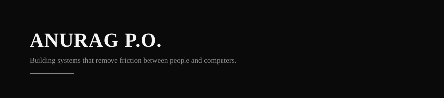

<picture>
  
</picture>

 

Second-year B.Tech CS student at GCET, Vadodara. I ship full-stack and AI systems, then get them into production — most recently an offline computer vision pipeline running on a chemical plant floor.

**[anuragpo.is-a.dev](https://anuragpo.is-a.dev/) &nbsp;·&nbsp; [LinkedIn](https://linkedin.com/in/anurag-po) &nbsp;·&nbsp; anuragpo393@gmail.com**

 

### GACL — Industrial OCR Pipeline

A month into my internship at Gujarat Alkalies & Chemicals Limited, my mentor sat me down in front of a SCADA dashboard and said the standard OCR tools weren't holding up on the UI. I built a replacement: an offline pipeline that reads live HMI tables through an IP camera, reconstructs them with custom grid detection and line regression (the off-the-shelf models kept producing phantom columns and misaligned diagonal cells), runs it through PaddleOCR, and exports to Excel with a human-review step before anything is finalized. No data leaves the building. It now runs at near-100% accuracy.

  

 

### Projects

<table>
  <tr>
    <td width="50%" valign="top">
      <strong>ALEX</strong> — Adaptive Logic EXecutor
        
      A deterministic AI execution layer. Natural language in, schema-validated JSON out; every action runs through a controlled function registry instead of unrestricted tool calls. Voice + text input, real-time overlay UI.
        
      
      
      
    </td>
    <td width="50%" valign="top">
      <strong>MinuteMind</strong> — AI Meeting Execution
        
      Turns meeting transcripts into structured, owned tasks through an async LLM pipeline with validation logic for missing owners and deadlines. Cut pilot workflow turnaround from 6 days to 2.
        
      
      
      
    </td>
  </tr>
  <tr>
    <td width="50%" valign="top">
      <strong>Nexlyra</strong> — Productivity Browser
        
      A keyboard-first desktop browser. Instead of treating every input as a URL, it classifies intent and routes to sites, search, or an AI assistant automatically.
        
      
      
    </td>
    <td width="50%" valign="top">
      <strong>Mnemosyne</strong> <em>— in progress</em>
        
      A memory layer for conversational agents that stores experiences as structured episodes instead of retrieving flat documents, with retrieval guided by explainable associations rather than vector similarity alone.
        
      
      
    </td>
  </tr>
</table>

 

### Stack

<table>
  <tr>
    <td valign="top"><strong>Languages</strong></td>
    <td>Python · JavaScript · C++</td>
  </tr>
  <tr>
    <td valign="top"><strong>AI / CV</strong></td>
    <td>OpenCV · PaddleOCR · LLM integration (Claude, Gemini)</td>
  </tr>
  <tr>
    <td valign="top"><strong>Backend</strong></td>
    <td>FastAPI · PostgreSQL · Supabase</td>
  </tr>
  <tr>
    <td valign="top"><strong>Frontend / Desktop</strong></td>
    <td>React · Next.js · Electron · PySide6</td>
  </tr>
</table>

 

> Build to understand. Refine until it feels inevitable.
